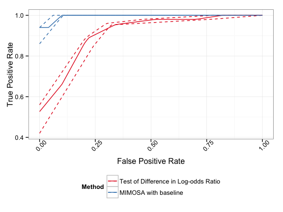

# Introduction 

Intracellular Cytokine Staining (ICS) assays are single-cell, cytometric assays that measure individual-level antigen-specific T-cell responses to stimulation. The assays are frequently used in vaccine trials to assess whether inidviduals have responded to the vaccine, i.e. whether their immune system has developed cellular memory to the vaccine insert. 

In its simplest form, an ICS assay provides two measurements: a measurement from a control sample (non-stimulated) and a measurement from a stimulated sample (stimulated with antigen from the vaccine). The readout from each is the number of cytokine-producing cells and the total number of T-cells assayed. 

To determine if an individual exhibits a response, the proportion of cytokine producing cells is compared between stimulation and control. If the proportion of cells in the stimulated sample is greater than in the non-stimulated sample, then the subject is deemed to have an antigen-specific response to the stimulation. 

The MIMOSA model (Finak _et al._ Biostatistics, 2013) was developed to analyze such data. It implements a Bayesian hierarchical model that models the cell counts rather than the proportion, and shares infomration across subjects to regularize small proportions and increase sensitivity and specificity.

MIMOSA2 extends the original model by allowing for time-based measurments in the form of baseline and post-vaccine measurments. The ICS assay is performed at two timepoints: the post-vaccine timepoint, but also at baseline (pre-vaccination). We are interested in identifying individuals that exhibit antigen-specific but also vaccine-specific responses. For example, an individual may respond at both timepoints with equal magnitude, in which case they would be considered to exhibit a non-specific response, or they may respond at the post-vaccine timepoint only, or more strongly at the post-vaccine than pre-vaccine timepoint, both of which would be indicative of antigen-specific and vaccine-specific responses. This package implements a five-component mixture model that allows for variations of the above possibilities in order to identify individuals with vaccine-specific responses. The model is described in more detail below.

# MIMOSA extended to model baseline.

We extend the MIMOSA model to allow fitting of two timepoints (not just post-vaccine).

For each subject, $i$, we observe a vector of counts $y_i :  (n^{(j,t)}_{i})$, where $t \in \{0,1\}$ indexes the timepoint and $j \in \{u,s\}$ indexes the stimulation. The counts represnt the number of positive cells for a cytokine or cytokine combination under study. We also observe the corresponding totals: $(N^{j,t}_{i})$

We model the counts as binomially distributed with unknown subject-specific proportions:
$n^{(s,1)}_{i} \sim Binomial(N^{(s,1)}_{i}, p^{(s,1)_i})$,  $n^{(s,0)}_{i} \sim Binomial(N^{(s,0)}_{i}, p^{(s,0)_i})$, and  $n^{(u,t)}_{i} \sim Binomial(N^{(u,t)}_{i}, p^{(u)_i})$. The unstimulated background is common across timepoints for each subject,
while the stimulated proportions are allowed to vary across the two timepoints.

As with MIMOSA, a given subject $i$ is a responder at a given timepoint $t$ if:
$p^{(s,t)} > p^{(u,t)}$ and the subject is a non-responder if $p^{(s,t)} = p^{(u,t)}$.
By the nature of the data, the proportions from stimulated samples will only be greater than or equal to the proportions from the non-stimulated samples.

As an additional complication, we are interested in vaccine-specific effects, where the post-vaccine stimulation at $t = 1$ is greater than the pre-vaccine stimulation at $t = 0$, such that
$p^{(s,1)}_i > p^{(s,0)}_i$ and $p^{(s,1)}_i > p^{u}_i$

We define a latent indicator $z = \{1..k\}$. If $z = 1$ the subject exhibits a vaccine-specific response and if $z > 1$, the subjects exhibits a non-specific response, or a non-response.

We set $k=5$, with the following model components.  
$\mathcal{M}_1: Pr(p^{(s,1)}_i | z = 1) = Beta(\mu^{(s,1)},\phi^{(s,1)}), Pr(p^{(s,0)}_i | z = 1) = Beta(\mu^{(s,0)},\phi^{(s,0)}), Pr(p^{(u)}_i | z = 1) = Beta(\mu^{(u)},\phi^{(u)})$  
$\mathcal{M}_2: Pr(p^{(s,1)}_i | z = 2) = Beta(\mu^{(u)},\phi^{(u)}), Pr(p^{(s,0)}_i | z = 2) = Beta(\mu^{(u)},\phi^{(u)}), Pr(p^{(u)}_i | z = 2) = Beta(\mu^{(u)},\phi^{(u)})$  
$\mathcal{M}_3: Pr(p^{(s,1)}_i | z = 3) = Beta(\mu^{(u)},\phi^{(u)}), Pr(p^{(s,0)}_i | z = 3) = Beta(\mu^{(s,0)},\phi^{(s,0)}), Pr(p^{(u)}_i | z = 3) = Beta(\mu^{(u)},\phi^{(u)})$    
$\mathcal{M}_4: Pr(p^{(s,1)}_i | z = 4) = Beta(\mu^{(s,0)},\phi^{(s,0)}), Pr(p^{(s,0)}_i | z = 4) = Beta(\mu^{(s,0)},\phi^{(s,0)}), Pr(p^{(u)}_i | z = 4) = Beta(\mu^{(u)},\phi^{(u)})$   
$\mathcal{M}_5: Pr(p^{(s,1)}_i | z = 5) = Beta(\mu^{(s,1)},\phi^{(s,1)}), Pr(p^{(s,0)}_i | z = 5) = Beta(\mu^{(u)},\phi^{(u)}), Pr(p^{(u)}_i | z = 5) = Beta(\mu^{(u)},\phi^{(u)})$   


Under $\mathcal{M}_1$ all proportions are different.  
Under $\mathcal{M}_2$ all proportions are equal to the background.  
Under $\mathcal{M}_3$ the pre-vaccine timepoint shows a response, but the post-vaccine timepoint does not.  
Under $\mathcal{M}_4$ the pre-vaccine and post-vaccine timepoints are both responses, but are equal, and thus non-specific responses. The response magnitude is at the pre-vaccine level.  
Component 1 represents vaccine-specific responses.  

The Beta distributions are parameterized as $\mu = \alpha+\beta, \phi = \alpha + \beta$.
Marginalizing out the $p$s, the posterior distributions of the counts are Beta-binomial with parameters $n + \alpha$ and  $N - n + \beta$.

The latent $z_i$ are modeled as independent draws from a categorical distribution with $k=5$, and parameter vector $w$.

By treating the $z_i$ as missing data, we can fit the model in an Empirical-Bayes  fashion using Expectation-Maximization and estimate the
parameter vector $\theta = (\mu^{(s,1)},\mu^{(s,0)},\mu^{(u)}\phi, w)$.
The complete data log-likelihood is given by:
$l(\theta|z,y) = \sum_{i,k} z_{i,k} l_k(\theta|y_i) + z_{i,k}\log(w_k)$

The $w_k$ are the mixing proportions, with the  constraint that $\sum_k w_k = 1$.

Given an estimate of the parameters $\tilde{\theta} = \{\tilde{\mu}^{(s,1)},\tilde{\mu}^{(s,0)},\tilde{\mu}^{(u)},\tilde{\phi}, \tilde{w}\}$ and the data,
we compute the posterior probabilities of response in the E step as $Pr(z_i = k | y, \tilde{\theta}) = \frac{\tilde{w} L_k(\tilde{\theta} | y_i)}{\sum_k \tilde{w} L_k(\tilde{\theta} | y_i)}$
In the M-step we estimate the parameters given the current assignments of the observations to model components. Because components 1 and 3 represent responders and components 2,4,5,6,7,8 represent non-responders,
we assign observations to responder components, defined as $r=1$ if $k=\{1\}$ such that $Pr(r = 1 | z_i) = \sum_{k \in \{1\}} z_{i,k}$ and $Pr(r = 0 | z_i) = 1-Pr(r = 1 | z_i)$. An observation is assigned as a responder if $Pr(r = 1 | z_i) > Pr(r = 0 | z_i)$ and a non-responder otherwise. The model component is set to $argmax_k(z_{i,k})$, conditioning on $r$.
The component weights are estimated as $\tilde{w} = \sum_i \tilde{z_i}/I$, and the model
remaining model parameters are estimated using numerical optimization using R's **optim** routine. To avoid convergence issues, the $\mu$ are fit on the $logit$ scale, while  $\phi$ is fit on the $log$ scale.

# Usage


```r
library(MIMOSA2)
library(data.table)
library(ggplot2)
```

We simulate from the model.


```r
s = simulate_MIMOSA2()
```

`s` is a `list` with components `names(s)`. `Ntot` is a matrix with column names "ns1" "nu1" "ns0" and "nu0". These correspond to the total T-cell counts for stimulated and unstimulated conditions at time 0 and time 1 (pre-vaccine and post-vaccine). There is also an entry "truth" which holds the ground truth model component from which each subject was simulated. 


Var    Freq
----  -----
NR       22
NV1      20
NV2       8
R        50

"R" corresponds to responders. "NR" corresponds to non-responders, and "NV1", and "NV2" correspond to non-vaccine specific responses.

The data is input into the `MIMOSA2` modeling function.


```r
fit = MIMOSA2(s$Ntot,s$ns1,s$nu1,s$ns0,s$nu0)
```

```
## - Log-Likelihood: 65681.5182391267
## - Log-Likelihood: 64607.1483637315
## - Log-Likelihood: 64594.7585758264
## - Log-Likelihood: 64587.6274841963
## - Log-Likelihood: 64585.0046185988
## - Log-Likelihood: 64583.2705794592
## - Log-Likelihood: 64582.4726250587
## - Log-Likelihood: 64581.9944376672
```

```
## done
```

The output of MIMOSA2 is a list with components `names(fit)`. The "z" is matrix with the probability that each observation arises from each component. "inds" holds the hard assignment of each observation to each model component. The hard assignments are done hierarchically, so if the probability that an observation arises from the two responder components is greater than the probability it arises from the non-responder or non-specific response components, then it is assigned to the response component with the greatest probability.

The confusion matrix from the model fit is shown below.


```r
table(fit=colnames(fit$inds)[max.col(fit$inds)],truth = s$truth)
```

```
##      truth
## fit   NR NV1 NV2  R
##   NR  21   8   2  0
##   NV1  1  11   0  1
##   NV2  0   1   4  2
##   R    0   0   2 47
```

We can plot the results.


```r
Boxplot(obj=fit,truth=s$truth)
```

 

We have two false positives, and three false negatives.

We can generate ROCs comparing against a standard test of odds ratios.


```r
ortest = ORTest(s$Ntot,s$ns1,s$nu1,s$ns0,s$nu0)
toplot = ROC(or_test=ortest, z=fit$z,truth=s$truth)
ROCPlot(toplot)+guides(color=guide_legend(nrow=2))
```

```
## Smoothing formula not specified. Using: y ~ qss(x, lambda = 1)
## Smoothing formula not specified. Using: y ~ qss(x, lambda = 1)
## Smoothing formula not specified. Using: y ~ qss(x, lambda = 1)
## Smoothing formula not specified. Using: y ~ qss(x, lambda = 1)
```

 

The ROC curves show that MIMOSA2 performs much better than a one-sided test for a difference in odds ratios. 


